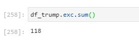

# Predicting 2020 Presidential election Using Twitter
## First-Part: Analyzing each candidate's tweets
1. Created developer account on Twitter
2. Authorized my API keys & access tokens
3. Fetched 200 tweets for each candidate due to limitation on user_timeline API 
4. Read tweets in dataframe
5. Preprocessed tweets for each candidate by eliminating hyperlinks, special characters, stop words.
6. Count the frequency of exclamation marks to show strong emotions:

        Exclamation Mark was used 118 times in Donald Trump tweets while only 3 times in Joe Biden tweets
       

7. when searched for the most 100 common word for each candidate:
   In Donald Trump Tweets, the name of his opponent was the first which is understandable because of the competition in election but in Joe Biden tweets the most common word was vote.
     

8. WordCloud for Donald Trump

9. WordCloud for Joe Biden

10. Donald Trump Sentiment Analysis
Positive tweets: 79 tweets out of 200 whith 39.50 %
Neutral tweets: 86 tweets out of 200 with 43 %
Negative tweets: 35 tweets out of 200 with 17.50 %

    

11. Joe Biden Sentiment Analysis
Positive tweets: 102 tweets out of 200 with 51 %
Neutral tweets: 66 out of 200 with 33 %
Negative tweets: 32 out of 200 with 16%

## Second-Part: Analyzing replies to each candidate:
The percentage is almost close as Donald Trump positive review rate is 61 % & 39 % negative
& for Joe Biden it's 60.67 % positive reviews & 39.33 % negative reviews  
S

