# Predicting 2020 Presidential election Using Twitter
I am aiming tp predict 2020 presidential elections through Sentiment analysis for each cndidate tweets, and how the people feel about each one.

we will need to install Tweepy to use Twitter:

    pip install tweepy

Liabraries Used in this project:
1. TextBlob to analyze sentiment
2. WorldCloud to visualize data
3. Pandas to read tweets in dataframe
4. Matplotlib to visualize data

### Signed up for Twitter Developer account to generate necessary tokens & keys
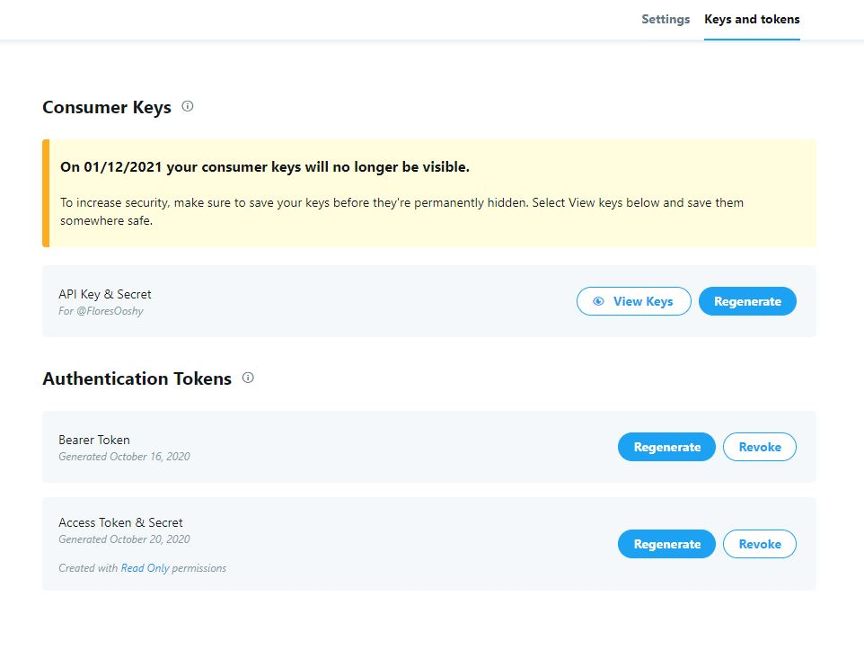

## Part 1-Fetched tweets Using API feature "user_timeline"
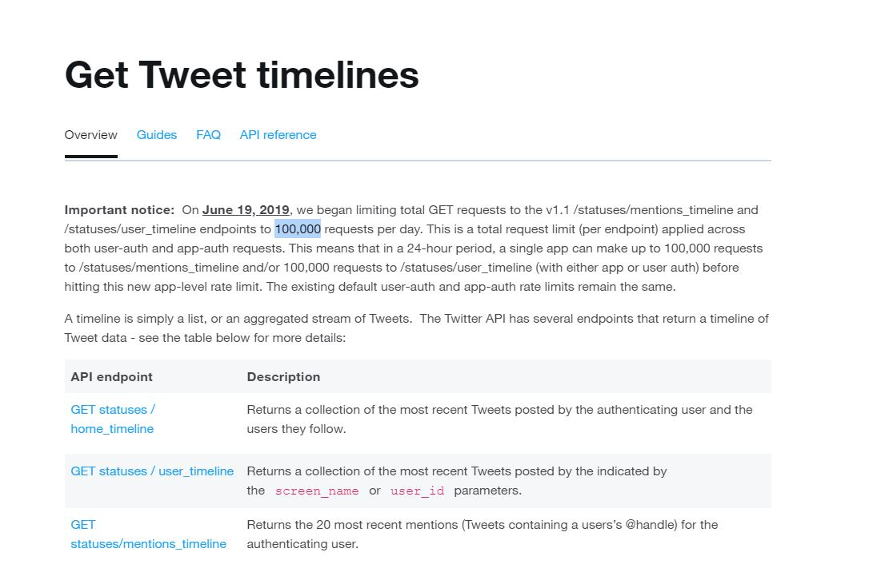

## Cleaned Tweets from hashtags, mentions, new line, hyperlinks

## Created functions to evaluate Rational & Emotional analysis of each tweet
* Polarity Evaulation : applied to measure Emotional reactions, where:
  - 1 = positive sentiment
  - 0 = neutral sentiment
  - -1 = negative sentiment

* Subjectivity Evaulation: applied to measure Rational reactions, where
  - 0 = very objective
  - 1 = very subjective

## Donald Trump findings out of 200 tweets:
- Positive tweets count & ratio: 79 tweets = 39.5 %
- Negative tweets count & ratio: 25 tweets = 12.50
- Neutral tweets count & ratio: 96 tweets = 48 %
- Exclamation Mark was used 140 times.

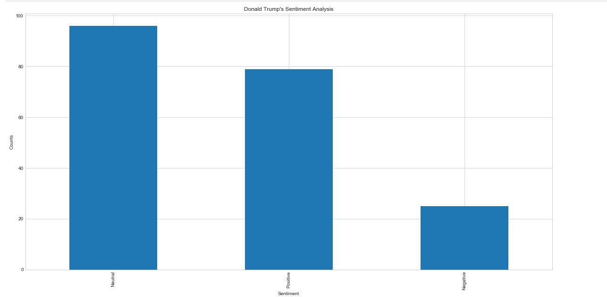
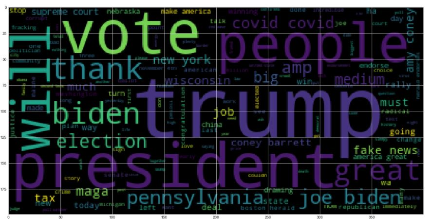

## Joe Biden findings out of 200 tweets:
- Positive tweets count & ratio: 100 tweets = 50 %
- Negative tweets count & ratio: 36 tweets = 18 %
- Neutral tweets count & ratio: 64 tweets = 32 %
- Exclamation Mark was used 4 times only.
  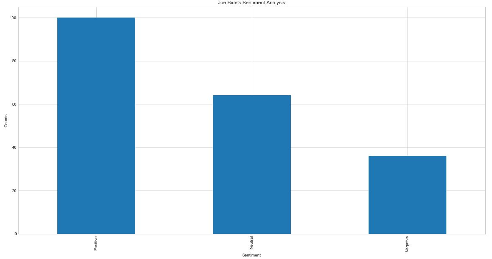
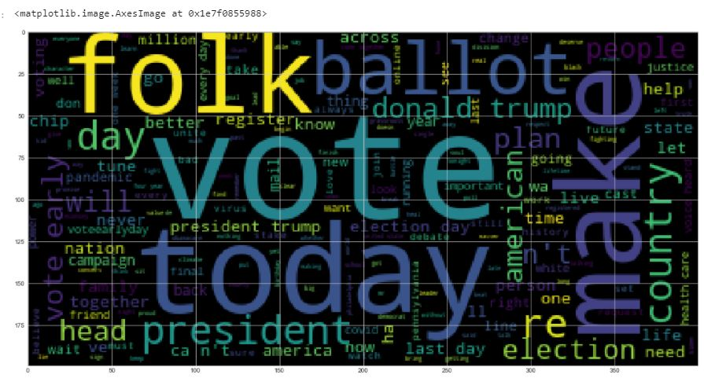

  
  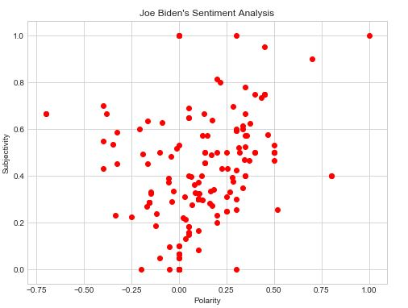 

## Part 2- Fetched 5000 replies to each candidate using tweet.Cursor to overcome limitation imposed on user timeline

## Measure rational & emotional replies to each candidate to gauge people preferences

## Out of 5000 replies, Donald Trump got:
- Voters who respond positively: 1063
- Voters who respond negatively: 1199
- Voters who respond neutral: 2738
 
  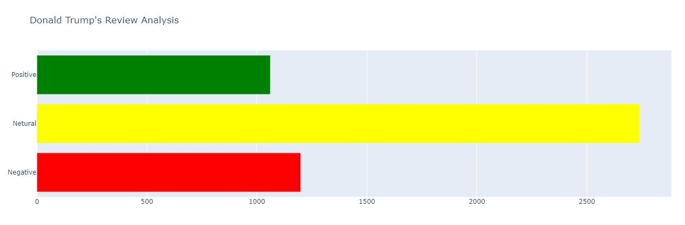

## Out of 5000 replies, Joe Biden got:
- Voters who respond positively: 1119
- Voters who respond negatively: 774
- Voters who respond neutral: 3107
   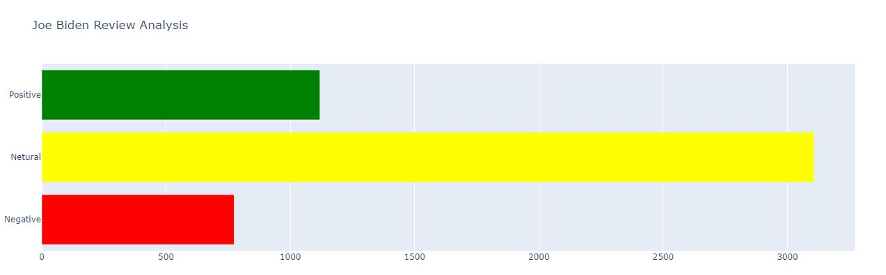

## Eliminate Neutral responses & balanced data to accurately comapre between each candidate & see who gets the most negative & positive feedback:

### Donald Trump                         
- Positive: 47.22 %
- Negative: 52.78 %
### Joe Biden
- Positive: 58.76 %
- Negative: 41.22 %

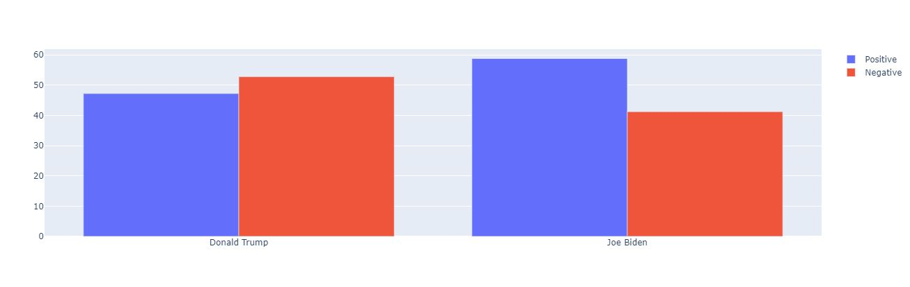

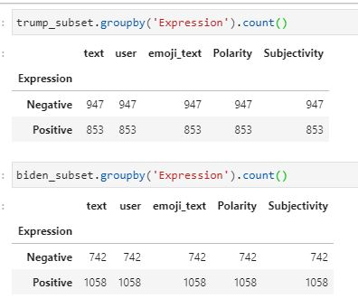

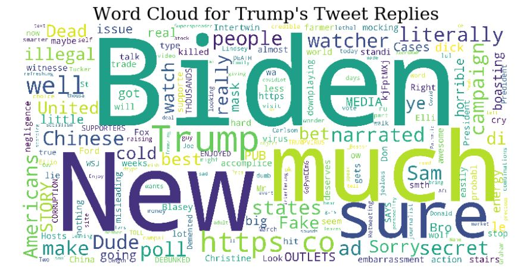
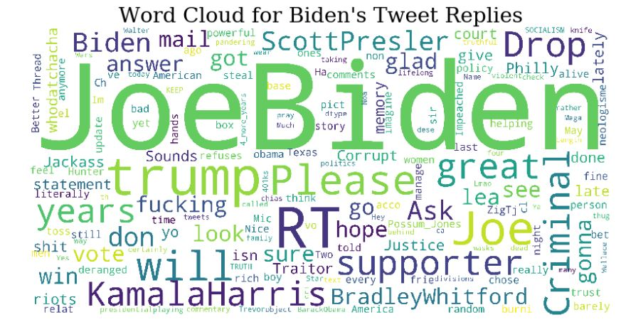

## References
https://stackoverflow.com/questions/46734636/tweepy-api-user-timeline-count-limited-to-200
https://developer.twitter.com/en/docs/twitter-api/v1/tweets/timelines/overview
https://www.debuggex.com/cheatsheet/regex/python
https://medium.com/@rahulvaish/textblob-and-sentiment-analysis-python-a687e9fabe96
https://planspace.org/20150607-textblob_sentiment/
https://towardsdatascience.com/having-fun-with-textblob-7e9eed783d3f

